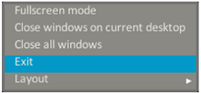
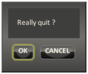

# Closing NUE

## Tray Method

1. Right-click on any empty space in the system tray\*
2. Select **Exit**

## Keyboard Shortcut Method

1. Use the operating-system-speific keyboard shortcut to exit the application. \(In Windows : **Alt + F4**\)
2. Cick **OK**


If NUE becomes unresponsive for any reason, use the operating system's Task Manager to end the process. \(In Windows Vista/7/8/10: **Ctrl + Shift + Esc**\)



\*To learn more about the system tray, refer to [System Tray](../user-interface-nue-desktop/system-tray/) in the User Interface section.


